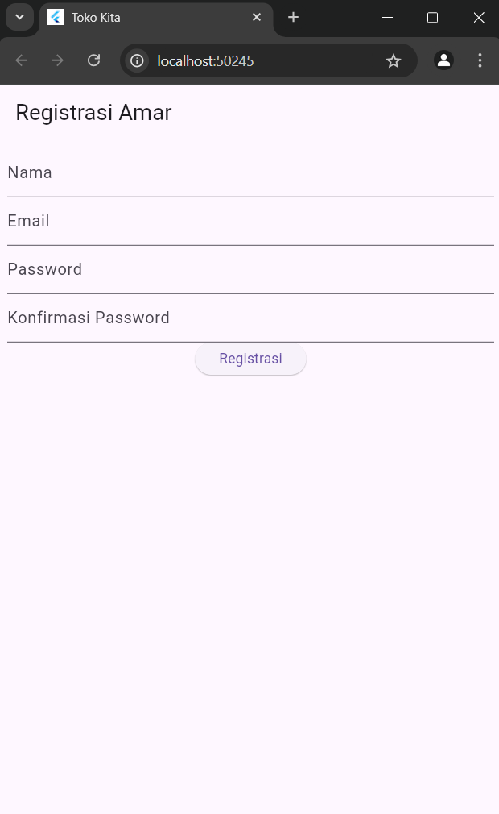
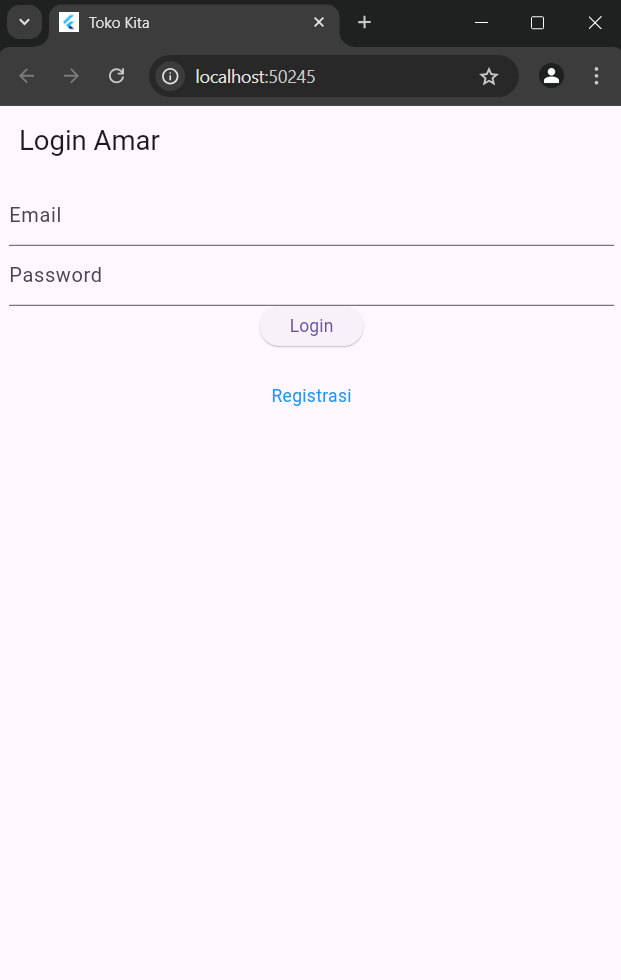
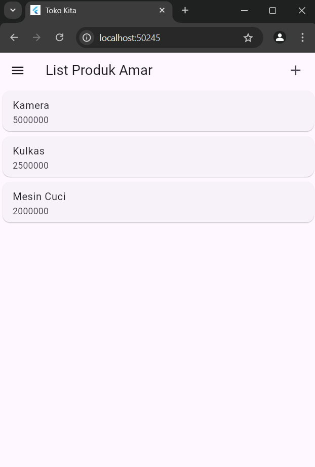
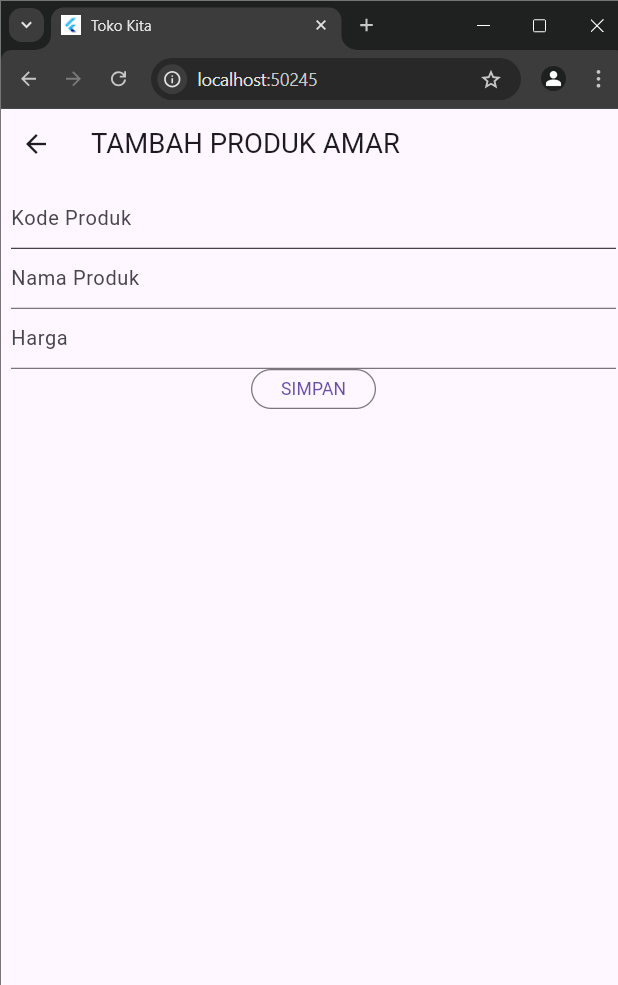
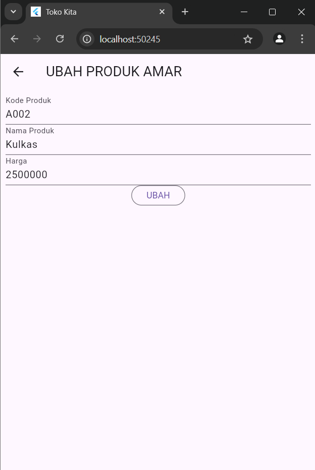
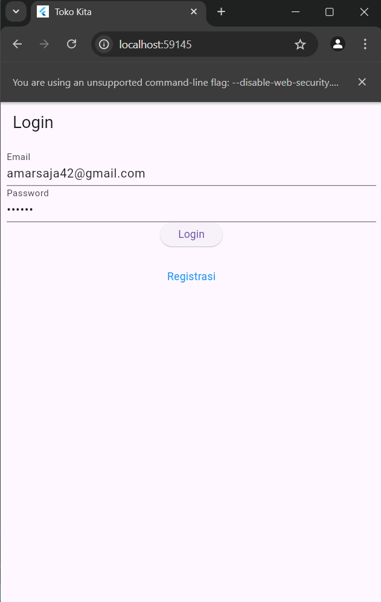

## Halaman Registrasi

## Halaman Login

## List Produk

## Detail Produk

## Tambah Produk

## Ubah Produk

# Tugas Pertemuan ke-5

## Proses Login

### Form Login

#### 1. Struktur Halaman Login
Halaman ini adalah sebuah StatefulWidget yang disebut LoginPage. Widget ini memiliki keadaan yang dapat berubah, seperti status loading dan nilai dari input teks.

#### 2. Kontrol Formulir
Form Key: final _formKey = GlobalKey<FormState>(); digunakan untuk mengelola status formulir, termasuk validasi dan penyimpanan data.
- Text Controllers: TextEditingController digunakan untuk mengakses nilai yang dimasukkan oleh pengguna ke dalam input teks untuk email dan password.
    
#### 3. Membangun Antarmuka Pengguna
- AppBar: Halaman ini memiliki AppBar dengan judul "Login".
- Form: Antarmuka pengguna terdiri dari formulir dengan dua input teks:
- Email: Input teks untuk memasukkan email.
- Password: Input teks untuk memasukkan password yang disembunyikan (obscure text).
- Tombol Login: Sebuah tombol login yang memproses data saat ditekan.
- Menu Registrasi: Teks berwarna biru yang ketika ditekan akan membawa pengguna ke halaman registrasi.
#### 4. Validasi Input
Setiap TextFormField memiliki fungsi validator yang memeriksa apakah input memenuhi kriteria tertentu:
- Email: Harus diisi (tidak boleh kosong).
- Password: Harus diisi (tidak boleh kosong).
#### 5. Proses Login
Tombol Login: Ketika tombol "Login" ditekan, aplikasi memvalidasi input terlebih dahulu. Jika input valid dan tidak dalam status loading (!_isLoading), maka proses login akan dimulai dengan memanggil fungsi _submit().
#### 6. Mengirim Data Login
- Dalam metode _submit():
    - Mengaktifkan Loading: Status loading diatur menjadi true untuk menunjukkan bahwa proses login sedang berlangsung.
    - Memanggil Fungsi Login: Fungsi LoginBloc.login dipanggil dengan parameter email dan password dari input pengguna.

### Pop Up Berhasil / Tidak

#### 7. Menangani Respons dari Server
- Berhasil (HTTP Code 200): Jika login berhasil, beberapa hal terjadi:
    - Menyimpan Token: Token yang diterima dari respons disimpan menggunakan UserInfo().setToken(value.token.toString()). Ini diperlukan untuk otentikasi di masa mendatang.
    - Menyimpan User ID: User ID dari respons juga disimpan menggunakan UserInfo().setUserID(int.parse(value.userID.toString())).
    Navigasi ke Halaman Produk: Setelah login berhasil, pengguna diarahkan ke halaman produk (ProdukPage) dengan metode Navigator.pushReplacement(), menggantikan halaman login dengan halaman produk.
    - Gagal: Jika login gagal atau ada kesalahan:
    Menampilkan Dialog Peringatan: Metode _showWarningDialog() akan dipanggil, yang akan menampilkan dialog peringatan (WarningDialog) dengan pesan bahwa login gagal.
#### 8. Menonaktifkan Status Loading
Setelah proses login selesai (baik berhasil maupun gagal), status loading diatur kembali menjadi false agar tombol login bisa digunakan kembali dan pengguna bisa berinteraksi dengan aplikasi.

## Proses Tambah Data Produk

#### 1. Struktur Halaman
- Widget: Halaman ini adalah sebuah StatefulWidget yang disebut ProdukForm, yang digunakan baik untuk menambah produk baru maupun mengubah produk yang sudah ada.
- State: Widget memiliki dua skenario: menambah produk baru atau mengubah produk, tergantung apakah parameter produk sudah ada (widget.produk != null).
#### 2. Kontrol Formulir
- Form Key: Kunci GlobalKey<FormState> digunakan untuk mengelola status dari form, memastikan validasi dan penyimpanan data terjadi dengan benar.
- Text Controllers: TextEditingController digunakan untuk mengakses data dari input teks untuk kode produk, nama produk, dan harga produk.
#### 3. Inisialisasi State (initState)
Fungsi isUpdate() dipanggil di dalam initState() untuk menentukan apakah formulir ini digunakan untuk menambah produk baru atau mengubah produk yang sudah ada. Jika produk sudah ada, input teks diisi dengan data produk tersebut dan teks tombol berubah menjadi "UBAH". Jika produk belum ada (form untuk menambah produk baru), tombol akan menampilkan "SIMPAN".
#### 4. Antarmuka Pengguna
- AppBar: Menampilkan judul halaman, yang berubah sesuai dengan tindakan yang sedang dilakukan ("TAMBAH PRODUK" atau "UBAH PRODUK").
- Formulir: Terdiri dari tiga TextFormField untuk memasukkan kode produk, nama produk, dan harga produk. Setiap input memiliki validasi:
    - Kode Produk: Harus diisi.
    - Nama Produk: Harus diisi.
    - Harga Produk: Harus diisi.
- Tombol Submit: Tombol ini akan menampilkan "SIMPAN" jika menambah produk baru, atau "UBAH" jika mengedit produk. Tombol akan memvalidasi data sebelum memproses simpan atau ubah.
#### 5. Validasi Input
Saat pengguna menekan tombol submit, fungsi validasi pada setiap TextFormField akan memeriksa apakah input telah diisi dengan benar (tidak kosong).
#### 6. Menyimpan Data Produk Baru (Fungsi simpan)
Jika validasi berhasil dan tidak dalam status loading, fungsi simpan() dipanggil:
- Mengaktifkan Loading: Status loading diubah menjadi true untuk menunjukkan bahwa aplikasi sedang memproses data.
- Membuat Objek Produk: Sebuah objek Produk dibuat dengan data yang diambil dari input teks (kode, nama, dan harga produk).
- Memanggil Fungsi addProduk: Fungsi ProdukBloc.addProduk dipanggil untuk mengirim data produk baru ke server atau API.
    Berhasil: Jika produk berhasil disimpan, pengguna akan diarahkan kembali ke halaman produk (ProdukPage) dengan menggunakan Navigator.of(context).push().
    Gagal: Jika ada kesalahan, dialog peringatan akan ditampilkan menggunakan WarningDialog.
#### 7. Menonaktifkan Status Loading
Setelah proses penyimpanan selesai, status loading diatur kembali menjadi false agar tombol bisa diaktifkan kembali dan pengguna bisa berinteraksi dengan aplikasi.

## Proses Menampilkan Data

### Menampilkan Semua Produk

#### 1. Struktur Halaman Utama (ProdukPage)
ProdukPage merupakan sebuah StatefulWidget yang digunakan untuk menampilkan daftar produk. Halaman ini memiliki beberapa elemen penting:
- AppBar: Menampilkan judul halaman dan memiliki ikon tambah (Icons.add) yang berfungsi untuk membuka halaman formulir produk baru (ProdukForm) saat diklik.
- Drawer: Berisi menu logout yang memanggil fungsi LogoutBloc.logout() untuk melakukan logout dan kembali ke halaman login (LoginPage).
- Body: Bagian utama dari halaman ini adalah menampilkan daftar produk, yang datanya diambil melalui FutureBuilder.

#### 2. Mengambil Data Produk
Data produk ditampilkan menggunakan FutureBuilder<List<Produk>> yang berfungsi untuk menjalankan operasi asinkron (dalam hal ini mengambil daftar produk) dan menampilkan hasilnya. Berikut adalah tahapan detailnya:
- Memanggil ProdukBloc.getProduks()
Pada bagian FutureBuilder, data produk diambil dari fungsi ProdukBloc.getProduks() yang mengembalikan daftar produk dalam bentuk Future<List<Produk>>.
- Menampilkan Loading Indicator
Selama data sedang diambil (saat future belum selesai), FutureBuilder akan menampilkan widget loading berupa CircularProgressIndicator di tengah layar, yang diatur dalam kondisi snapshot belum memiliki data.
- Menampilkan Daftar Produk
Setelah data berhasil diambil, snapshot akan memiliki data (snapshot.hasData == true), dan data tersebut akan diteruskan ke widget ListProduk, yang bertanggung jawab untuk menampilkan daftar produk dalam bentuk list.

#### 3. Menampilkan List Produk (ListProduk)
ListProduk adalah widget yang bertanggung jawab untuk menampilkan daftar produk dalam bentuk list menggunakan ListView.builder. Berikut detailnya:
- Menentukan Jumlah Produk
ListView.builder akan membuat widget sebanyak jumlah produk yang ada dalam list yang diterima dari snapshot.data. Jumlah item ditentukan oleh list?.length ?? 0 yang mengecek apakah list produk tersedia atau tidak.
- Menampilkan Item Produk
Untuk setiap item di dalam list, ListView.builder akan membuat sebuah widget ItemProduk, yang menampilkan detail dari produk. Widget ini bertugas untuk menampilkan nama dan harga produk dalam bentuk ListTile, yang diapit oleh Card.

#### 4. Menampilkan Setiap Produk (ItemProduk)
ItemProduk merupakan widget individual untuk setiap produk yang akan ditampilkan di dalam ListProduk. Setiap item memiliki:
GestureDetector: Ketika produk ditekan, pengguna akan diarahkan ke halaman detail produk (ProdukDetail).Card: Membungkus ListTile yang menampilkan nama produk dan harga produk.

### Menampilkan Detail Produk

#### 1. Struktur Halaman ProdukDetail
ProdukDetail merupakan sebuah StatefulWidget yang digunakan untuk menampilkan informasi detail dari satu produk yang dipilih. Objek produk diterima dari halaman sebelumnya, misalnya saat pengguna memilih produk dari daftar di ProdukPage.
    Halaman ini memiliki beberapa elemen penting:
- AppBar: Menampilkan judul halaman "Detail Produk".
- Body: Menampilkan informasi detail produk seperti kode, nama, dan harga produk, serta tombol untuk mengedit atau menghapus produk.
        
#### 2. Menampilkan Data Produk
Data produk yang diterima dari halaman sebelumnya diteruskan ke widget.produk, yang digunakan untuk menampilkan detail informasi produk pada tampilan.

Contohnya:

    Text(
        "Kode : ${widget.produk!.kodeProduk}",
        style: const TextStyle(fontSize: 20.0),
    ),
    Text(
        "Nama : ${widget.produk!.namaProduk}",
        style: const TextStyle(fontSize: 18.0),
    ),
    Text(
        "Harga : Rp. ${widget.produk!.hargaProduk.toString()}",
        style: const TextStyle(fontSize: 18.0),
    ),
    
Di sini, masing-masing informasi produk seperti kode, nama, dan harga produk diambil dari properti kodeProduk, namaProduk, dan hargaProduk pada objek widget.produk. Data ini kemudian ditampilkan dalam Text widget yang disusun dalam kolom.

#### 3. Tombol Edit dan Hapus
Di bagian bawah halaman, ada dua tombol utama yang menyediakan fungsi edit dan hapus produk:

- Tombol Edit: Mengarahkan pengguna ke halaman ProdukForm untuk mengedit produk yang dipilih.Saat tombol "EDIT" ditekan, pengguna diarahkan ke halaman form untuk mengedit produk. Produk yang sedang ditampilkan dikirimkan ke ProdukForm sebagai parameter.
    
        OutlinedButton(
            child: const Text("EDIT"),
            onPressed: () {
                Navigator.push(
                    context,
                    MaterialPageRoute(
                        builder: (context) => ProdukForm(produk: widget.produk!),
                    ),
                );
            },
        ),
- Tombol Hapus: Menampilkan dialog konfirmasi sebelum menghapus produk yang dipilih. Saat tombol "DELETE" ditekan, fungsi confirmHapus() akan dipanggil untuk menampilkan dialog konfirmasi penghapusan.
    
        OutlinedButton(
            child: const Text("DELETE"),
            onPressed: () => confirmHapus(),
        ),
    
#### 4. Proses Konfirmasi Hapus
Jika pengguna menekan tombol "DELETE", dialog konfirmasi akan muncul melalui fungsi confirmHapus(). Dialog ini memberikan dua opsi:

- Tombol "Ya": Jika ditekan, produk akan dihapus dengan memanggil fungsi ProdukBloc.deleteProduk(id: widget.produk!.id!).

        ProdukBloc.deleteProduk(id: widget.produk!.id!).then(
            (value) {
                Navigator.of(context).push(MaterialPageRoute(
                builder: (context) => const ProdukPage(),
                ));
            },
        );
    Jika penghapusan berhasil, pengguna akan diarahkan kembali ke halaman daftar produk (ProdukPage).
    Jika penghapusan gagal, dialog peringatan akan muncul dengan pesan "Hapus gagal, silahkan coba lagi".
    
        onError: (error) {
          showDialog(
            context: context,
            builder: (BuildContext context) => const WarningDialog(
              description: "Hapus gagal, silahkan coba lagi",
            ),
          );
        },
        
        
- Tombol "Batal": Jika ditekan, dialog konfirmasi akan ditutup tanpa menghapus produk.

        OutlinedButton(
          child: const Text("Batal"),
          onPressed: () => Navigator.pop(context),
        ),
